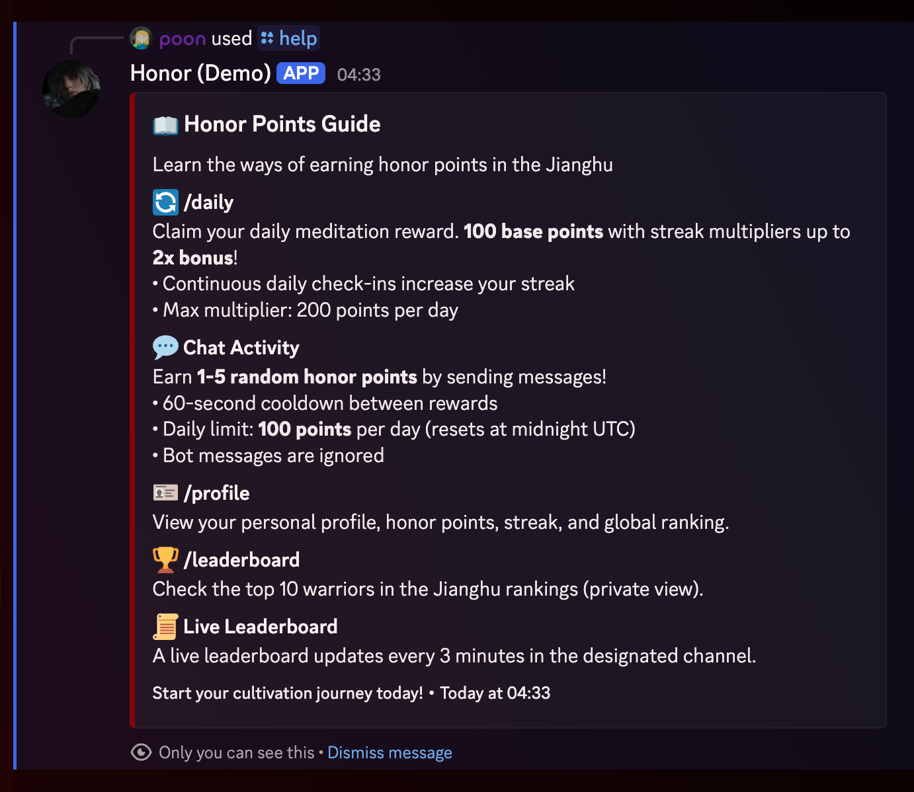

# HonorBot PBZ

<div align="center"></div>

**A feature-rich Discord bot for managing an honor points economy system with real-time leaderboards, daily check-ins, and an admin dashboard**


[Features](#features) • [Installation](#installation) • [Setup](#setup) • [Demo & Usage](#demo--usage-examples) • [Documentation](#configuration)

</div>

---

## Introduction

**HonorBot PBZ** is a comprehensive Discord.js v14 bot built with TypeScript that gamifies server interaction through an honor points system. Inspired by the dark Wuxia theme of Phantom Blade Zero, it provides a complete economy system with automatic point earning, daily check-ins with streak bonuses, real-time leaderboards, and a powerful admin dashboard.

### Key Highlights

- 🎮 **Interactive Slash Commands** - User-friendly Discord slash commands for all interactions
- 📊 **Real-time Leaderboard** - Automatically updates every 3 minutes in a designated channel
- 🎯 **Smart Point System** - Earn points through chat activity with daily limits and cooldowns
- 🔥 **Daily Streak System** - Consecutive daily check-ins reward increasing multipliers (up to 2x)
- 🌐 **Admin Dashboard** - Web-based admin panel for managing users and viewing statistics
- 🔒 **Security First** - Comprehensive security audit with rate limiting, input validation, and XSS protection
- 🐳 **Docker Ready** - Full Docker Compose support for easy deployment

---

## Features

### 🎮 User Commands

- **`/daily`** - Claim daily honor points with streak multiplier (100 base points, up to 200 with max streak)
- **`/profile`** - View your honor points, rank, daily streak, and join date
- **`/leaderboard`** - Check the top 10 users privately (ephemeral response)
- **`/help`** - View available commands and how to earn honor points

### ⚡ Automatic Features

- **Message Points System** - Earn 1-5 random honor points per message
  - 60-second cooldown between rewards
  - Daily limit: 100 points (configurable)
  - Resets at midnight UTC
- **Real-time Leaderboard** - Auto-updates every 3 minutes in a designated channel
  - Shows top 10 users with rankings
  - Medal emojis for top 3 (🥇🥈🥉)
- **Daily Streak System** - Streak multiplier for daily check-ins (enabled by default)
  - Consecutive daily check-ins increase your streak bonus
  - Day 1: 100 points (1x multiplier)
  - Day 2: 110 points (1.1x multiplier)
  - Day 10+: 200 points (2x multiplier, maximum)
  - Missing a day resets the streak to Day 1

### 👑 Admin Commands

- **`/backup export`** - Export entire database backup (Administrator only, sent via DM)
- **`/backup import <file>`** - Import database backup from JSON file (Administrator only)

### 🌐 Web Dashboard

- **Admin Panel** - Full-featured web interface at `http://localhost:3000`
- **User Management** - Edit user points, reset streaks, search by username
- **Leaderboard View** - View top 50 users with real-time updates
- **Secure Authentication** - Protected with HTTP Basic Auth
- **Modern UI** - Dark Wuxia-themed design with Tailwind CSS

---

## Prerequisites

Before you begin, ensure you have the following installed:

- **Node.js** 18.0.0 or higher
- **npm** (comes with Node.js) or **yarn**
- **MongoDB** (local installation or cloud instance like MongoDB Atlas)
- **Discord Bot Token** ([How to create a Discord bot](https://discord.com/developers/applications))
- **Discord Application Client ID** (from your Discord Developer Portal)
- **Discord Server (Guild) ID** (the server where you want to deploy the bot)

### Optional Prerequisites

- **Docker & Docker Compose** (for containerized deployment)
- **Git** (for cloning the repository)

---

## Installation

### Step 1: Clone the Repository

```bash
git clone <your-repo-url>
cd honorbot-pbz
```

### Step 2: Install Dependencies

```bash
npm install
```

This will install all required dependencies including:

- `discord.js` v14
- `mongoose` for MongoDB
- `express` for the web dashboard
- `typescript` and related type definitions
- And other production and development dependencies

### Step 3: Build the Project

```bash
npm run build
```

This compiles TypeScript source files to JavaScript in the `dist/` directory.

---

## Setup

### Step 1: Configure Environment Variables

Create a `.env` file in the root directory. You can use the template below:

```env
# Discord Configuration
DISCORD_TOKEN=your_discord_bot_token_here
CLIENT_ID=your_discord_client_id_here
GUILD_ID=your_discord_guild_id_here

# MongoDB Configuration
MONGO_URI=mongodb://localhost:27017/honorbot
# For Docker Compose, use: mongodb://mongodb:27017/honorbot

# Leaderboard Channel
LEADERBOARD_CHANNEL_ID=your_leaderboard_channel_id_here

# Web Dashboard Configuration
PORT=3000
WEB_USER=admin
WEB_PASS=your_secure_password_here_change_this
ALLOWED_ORIGIN=http://localhost:3000

# Feature Flags
ENABLE_STREAK=true

# Message Points System
DAILY_MESSAGE_POINTS_LIMIT=100

# Environment
NODE_ENV=production
```

**⚠️ Important Security Notes:**

- Never commit your `.env` file to version control (already in `.gitignore`)
- Use a strong password for `WEB_PASS` in production
- Keep your `DISCORD_TOKEN` secret and secure

### Step 2: Set Up MongoDB

#### Option A: Local MongoDB

1. Install MongoDB locally ([Download MongoDB](https://www.mongodb.com/try/download/community))
2. Start MongoDB service
3. Update `MONGO_URI` in `.env` to: `mongodb://localhost:27017/honorbot`

#### Option B: MongoDB Atlas (Cloud)

1. Create a free account at [MongoDB Atlas](https://www.mongodb.com/cloud/atlas)
2. Create a cluster and database
3. Get your connection string and update `MONGO_URI` in `.env`

#### Option C: Docker Compose (Recommended for Development)

See [Docker Deployment](#docker-deployment) section below.

### Step 3: Deploy Discord Slash Commands

Before starting the bot, you need to register the slash commands with Discord:

```bash
npm run deploy
```

**Expected Output:**

```
[Deploy] Starting to refresh X application (/) commands...
[Deploy] ✓ Successfully reloaded X application (/) commands.
[Deploy] Registered commands: daily, profile, leaderboard, help, backup
```

If you encounter any issues or need to clear commands:

```bash
npm run clear-commands
npm run deploy
```

### Step 4: Start the Bot

#### Development Mode (with auto-reload)

```bash
npm run dev
```

This uses `nodemon` to automatically restart the bot when files change. Useful for development.

#### Production Mode

```bash
npm start
```

**Expected Output:**

```
Bot is starting...
Connected to MongoDB successfully
Logged in as YourBotName#1234!
Bot is ready! Use "npm run deploy" to register slash commands.
[Dashboard] Admin Panel running on http://localhost:3000
[LeaderboardService] Starting leaderboard service...
```

---

## Demo & Usage Examples

This section provides visual examples and terminal outputs to help you understand how HonorBot PBZ works.

### Discord Commands in Action

#### `/daily` Command Example


#### `/profile` Command Example


#### `/leaderboard` Command Example



#### `/help` Command Example


### Real-time Leaderboard Channel


### Admin Web Dashboard

#### Dashboard Overview


#### User Management Modal


#### Dashboard Search Functionality


### Usage Workflow Examples

#### Example 1: New User Journey

1. **First Message:** User sends a message → Earns 3 points (logged to console)
2. **Check Profile:** User runs `/profile` → Sees "Unranked" status
3. **Daily Check-in:** User runs `/daily` → Earns 100 points, streak starts at 1 day
4. **More Messages:** User chats → Earns more points, daily counter increments
5. **Check Rankings:** User runs `/leaderboard` → Sees their position

#### Example 2: Streak Building

1. **Day 1:** `/daily` → 100 points (1x multiplier, streak: 1 day)
2. **Day 2:** `/daily` → 110 points (1.1x multiplier, streak: 2 days) 🔥
3. **Day 3:** `/daily` → 120 points (1.2x multiplier, streak: 3 days) 🔥
4. **Day 10:** `/daily` → 200 points (2x multiplier, streak: 10 days) 🔥🔥

#### Example 3: Admin Backup Workflow

<div align="center">
  
  
</div>

---

## Docker Deployment

### Using Docker Compose (Recommended)

Docker Compose simplifies deployment by managing both MongoDB and the bot application.

#### Step 1: Update Environment Variables

Ensure your `.env` file has:

```env
MONGO_URI=mongodb://mongodb:27017/honorbot
```

Note: Use `mongodb` as the hostname (Docker service name), not `localhost`.

#### Step 2: Build and Start Services

```bash
docker-compose up --build -d
```

This will:

- Build the bot Docker image
- Start MongoDB container
- Start the bot application container
- Create necessary volumes for data persistence

#### Step 3: View Logs

```bash
# View all logs
docker-compose logs -f

# View only bot logs
docker-compose logs -f app

# View only MongoDB logs
docker-compose logs -f mongodb
```

#### Step 4: Deploy Commands (from within container)

```bash
docker-compose exec app npm run deploy
```

#### Step 5: Stop Services

```bash
docker-compose down
```

To also remove volumes (⚠️ **WARNING:** This deletes your database):

```bash
docker-compose down -v
```

### Manual Docker Build

If you prefer to build and run manually:

```bash
# Build the image
docker build -t honorbot-pbz .

# Run the container
docker run -d \
  --name honorbot-app \
  --env-file .env \
  -p 3000:3000 \
  --link mongodb:mongodb \
  honorbot-pbz
```

---

## Configuration

### Environment Variables

| Variable                     | Description                                                | Required | Default                 |
| ---------------------------- | ---------------------------------------------------------- | -------- | ----------------------- |
| `DISCORD_TOKEN`              | Discord bot token                                          | ✅ Yes   | -                       |
| `CLIENT_ID`                  | Discord application client ID                              | ✅ Yes   | -                       |
| `GUILD_ID`                   | Discord server (guild) ID                                  | ✅ Yes   | -                       |
| `MONGO_URI`                  | MongoDB connection string                                  | ✅ Yes   | -                       |
| `LEADERBOARD_CHANNEL_ID`     | Channel ID for leaderboard updates                         | ✅ Yes   | -                       |
| `PORT`                       | Web dashboard port                                         | ❌ No    | `3000`                  |
| `WEB_USER`                   | Admin panel username                                       | ❌ No    | `admin`                 |
| `WEB_PASS`                   | Admin panel password (⚠️ **REQUIRED in production**)       | ❌ No    | `password` (dev only)   |
| `ENABLE_STREAK`              | Enable daily streak multiplier (set to 'false' to disable) | ❌ No    | `true`                  |
| `DAILY_MESSAGE_POINTS_LIMIT` | Daily limit for message points                             | ❌ No    | `100`                   |
| `ALLOWED_ORIGIN`             | CORS allowed origin for dashboard                          | ❌ No    | `http://localhost:3000` |
| `NODE_ENV`                   | Environment mode (`production` or `development`)           | ❌ No    | `production`            |

### Feature Flags

#### `ENABLE_STREAK`

Controls the daily streak multiplier system:

- **Default:** `true` (enabled)
- **Set to `false`** to disable streak bonuses (users always get 100 points)
- **When enabled:** Users receive increasing multipliers:
  - Day 1: 100 points (1.0x)
  - Day 2: 110 points (1.1x)
  - Day 3: 120 points (1.2x)
  - Day 4: 130 points (1.3x)
  - Day 5: 140 points (1.4x)
  - Day 6: 150 points (1.5x)
  - Day 7: 160 points (1.6x)
  - Day 8: 170 points (1.7x)
  - Day 9: 180 points (1.8x)
  - Day 10+: 200 points (2.0x maximum)
- **Streak Reset:** Missing a day resets to Day 1

#### `DAILY_MESSAGE_POINTS_LIMIT`

Controls how many points users can earn from messages per day:

- **Default:** `100`
- **Recommendations:**
  - `50` - More restrictive, quality-focused
  - `100` - Balanced (default)
  - `150` - More lenient for active servers
  - `200` - Maximum for highly active communities
- Resets automatically at midnight UTC

---

## Usage

### Setting Up Discord Commands

#### Initial Deployment

```bash
npm run deploy
```

This registers all slash commands to your Discord server. Commands appear immediately in Discord.

#### Updating Commands

After modifying command files:

```bash
npm run build
npm run deploy
```

#### Clearing All Commands

If you need to remove all commands:

```bash
npm run clear-commands
```

Then redeploy with `npm run deploy`.

### Accessing the Admin Dashboard

1. **Start the bot** (see [Setup](#setup) section)
2. **Navigate to:** `http://localhost:3000` in your browser
3. **Login with:**
   - Username: Your `WEB_USER` (default: `admin`)
   - Password: Your `WEB_PASS`
4. **Features Available:**
   - View top 50 users in leaderboard
   - Search users by username
   - Edit user honor points
   - Reset user streaks
   - Real-time updates (refreshes every 30 seconds)

### Backup and Restore

#### Exporting Database

1. In Discord, use the `/backup export` command (Administrator only)
2. The bot will send you a JSON file via Direct Message
3. Save this file securely - it contains all user data

#### Importing Database

1. Prepare your backup JSON file
2. In Discord, use `/backup import`
3. Attach the JSON file to the command
4. The bot will import all users and update existing records
5. You'll receive a summary of imported/updated records

**⚠️ Warning:** Importing will overwrite existing user data. Always backup before importing.

---

## Project Structure

```
honorbot-pbz/
├── demo-usage-examples/    # Screenshots and demo images (add your images here)
│   ├── daily-command-first.png
│   ├── daily-command-streak.png
│   ├── profile-command.png
│   ├── leaderboard-command.png
│   ├── help-command.png
│   ├── leaderboard-channel.png
│   ├── admin-dashboard-overview.png
│   ├── admin-edit-modal.png
│   ├── admin-dashboard-search.png
│   ├── terminal-bot-startup.png
│   ├── terminal-command-deployment.png
│   ├── terminal-message-points.png
│   ├── terminal-leaderboard-update.png
│   ├── terminal-bot-running.png
│   ├── terminal-error-handling.png
│   ├── backup-export.png
│   └── backup-import.png
├── src/
│   ├── commands/              # Discord slash commands
│   │   ├── backup.ts          # Admin backup/restore commands
│   │   ├── daily.ts           # Daily check-in command
│   │   ├── help.ts            # Help command
│   │   ├── leaderboard.ts     # Leaderboard command
│   │   └── profile.ts         # User profile command
│   ├── dashboard/             # Web admin panel
│   │   ├── public/            # Static files (HTML, CSS, JS)
│   │   │   └── index.html     # Admin dashboard UI
│   │   └── server.ts          # Express server and API endpoints
│   ├── events/                # Discord event handlers
│   │   ├── interactionCreate.ts  # Handles slash command interactions
│   │   └── messageCreate.ts      # Handles message events (point earning)
│   ├── models/                # Mongoose schemas
│   │   └── User.ts            # User data model
│   ├── services/              # Business logic services
│   │   ├── BackupService.ts   # Database backup/restore logic
│   │   └── LeaderboardService.ts  # Leaderboard update service
│   ├── utils/                 # Utility functions
│   │   └── connectDB.ts       # MongoDB connection handler
│   ├── deploy-commands.ts     # Script to deploy slash commands
│   ├── clear-commands.ts      # Script to clear all commands
│   └── index.ts               # Main entry point
├── dist/                      # Compiled JavaScript (generated)
├── node_modules/              # Dependencies (generated)
├── docker-compose.yml         # Docker Compose configuration
├── Dockerfile                 # Docker build configuration
├── tsconfig.json              # TypeScript configuration
├── package.json               # Node.js dependencies and scripts
├── package-lock.json          # Dependency lock file
├── .gitignore                 # Git ignore rules
├── SECURITY_AUDIT.md          # Security audit report
├── PRE_DEPLOYMENT_CHECKLIST.md # Pre-deployment checklist
└── README.md                  # This file
```

---

## Scripts

| Script                   | Description                                         |
| ------------------------ | --------------------------------------------------- |
| `npm run build`          | Compile TypeScript to JavaScript                    |
| `npm start`              | Start the production server (requires build first)  |
| `npm run dev`            | Start development server with auto-reload (nodemon) |
| `npm run watch`          | Watch TypeScript files and compile on changes       |
| `npm run deploy`         | Deploy slash commands to Discord                    |
| `npm run clear-commands` | Clear all Discord slash commands                    |

---

## Technologies

### Core Technologies

- **[Discord.js v14](https://discord.js.org/)** - Modern Discord API wrapper for Node.js
- **[TypeScript](https://www.typescriptlang.org/)** - Type-safe JavaScript for better code quality
- **[MongoDB](https://www.mongodb.com/)** - NoSQL database for user data storage
- **[Mongoose](https://mongoosejs.com/)** - MongoDB object modeling for Node.js
- **[Express.js](https://expressjs.com/)** - Fast, minimalist web framework for the admin dashboard

### Supporting Libraries

- **[Node-cron](https://www.npmjs.com/package/node-cron)** - Task scheduler for automated leaderboard updates
- **[Tailwind CSS](https://tailwindcss.com/)** - Utility-first CSS framework for dashboard styling
- **[express-rate-limit](https://www.npmjs.com/package/express-rate-limit)** - Rate limiting middleware for API protection
- **[express-basic-auth](https://www.npmjs.com/package/express-basic-auth)** - HTTP Basic Authentication for dashboard
- **[dotenv](https://www.npmjs.com/package/dotenv)** - Environment variable management

### Development Tools

- **[nodemon](https://nodemon.io/)** - Automatic server restart during development
- **[ts-node](https://typestrong.org/ts-node/)** - TypeScript execution for Node.js
- **[Docker](https://www.docker.com/)** - Containerization for consistent deployments

---

## Security

This project follows security best practices and has undergone a comprehensive security audit. For detailed information about security considerations, vulnerabilities found, and fixes implemented, please see [`SECURITY_AUDIT.md`](./SECURITY_AUDIT.md).

### Security Features

- ✅ **Input Validation** - All user inputs are validated and sanitized
- ✅ **XSS Protection** - Proper HTML escaping and event delegation
- ✅ **Rate Limiting** - API endpoints protected against brute-force and DoS attacks
  - General API: 100 requests per 15 minutes
  - Write operations: 50 requests per 15 minutes
- ✅ **Authentication** - Basic Auth with strong password requirements
- ✅ **CORS Protection** - Restricted cross-origin requests
- ✅ **NoSQL Injection Protection** - Mongoose parameterized queries
- ✅ **Error Sanitization** - Production-safe error messages
- ✅ **Path Traversal Protection** - Explicit path validation
- ✅ **Secrets Management** - Environment variables, no hardcoded credentials

### Reporting Security Issues

If you discover a security vulnerability, please **do not** open a public issue. Instead, please report it privately via:

- Opening a security advisory on GitHub
- Contacting the maintainers directly

We take security seriously and will respond promptly to any security concerns.

---

## Troubleshooting

### Common Issues

#### Bot doesn't respond to commands

1. **Check if commands are deployed:**
   ```bash
   npm run deploy
   ```
2. **Verify bot has required permissions:**
   - View Channels
   - Send Messages
   - Embed Links
   - Read Message History
3. **Check bot is online** in your Discord server

#### Leaderboard not updating

1. **Verify `LEADERBOARD_CHANNEL_ID` is set correctly** in `.env`
2. **Check bot has permissions** in the leaderboard channel:
   - View Channel
   - Send Messages
   - Manage Messages (to edit existing leaderboard)
3. **Check logs** for leaderboard service errors:
   ```bash
   # If using Docker
   docker-compose logs -f app | grep LeaderboardService
   ```

#### MongoDB connection errors

1. **Verify MongoDB is running:**

   ```bash
   # Local MongoDB
   mongosh

   # Docker
   docker-compose ps mongodb
   ```

2. **Check `MONGO_URI` is correct** in `.env`
3. **For Docker Compose:** Use `mongodb://mongodb:27017/honorbot` (not `localhost`)

#### Dashboard not accessible

1. **Verify bot is running** and dashboard started:
   ```
   [Dashboard] Admin Panel running on http://localhost:3000
   ```
2. **Check port 3000 is not in use:**

   ```bash
   # Linux/Mac
   lsof -i :3000

   # Windows
   netstat -ano | findstr :3000
   ```

3. **Change `PORT` in `.env`** if port 3000 is occupied

#### TypeScript compilation errors

1. **Clean and rebuild:**
   ```bash
   rm -rf dist/
   npm run build
   ```
2. **Verify Node.js version:**
   ```bash
   node --version  # Should be 18+
   ```
3. **Reinstall dependencies:**
   ```bash
   rm -rf node_modules package-lock.json
   npm install
   ```

---

## Contributing

Contributions are welcome! Please feel free to submit a Pull Request. When contributing:

1. **Fork the repository**
2. **Create a feature branch:** `git checkout -b feature/amazing-feature`
3. **Commit your changes:** `git commit -m 'Add amazing feature'`
4. **Push to the branch:** `git push origin feature/amazing-feature`
5. **Open a Pull Request**

### Development Guidelines

- Follow existing code style and TypeScript conventions
- Add comments for complex logic
- Update documentation for new features
- Test your changes thoroughly
- Ensure `npm run build` completes without errors

---

## License

This project is licensed under the **ISC License**.

---

## Support

For issues and questions:

- **Open an issue** on GitHub for bug reports or feature requests
- **Check existing issues** before creating new ones
- **Read the documentation** thoroughly before asking questions

---

## Acknowledgments

- Inspired by the Wuxia theme of **Phantom Blade Zero**
- Built with [Discord.js](https://discord.js.org/) - A powerful library for interacting with the Discord API
- Uses [Mongoose](https://mongoosejs.com/) for elegant MongoDB object modeling

---

<div align="center">

**Made with ❤️ for the Discord community**

**⚠️ Note:** Make sure to keep your `.env` file secure and never commit it to version control. The `.gitignore` file is already configured to exclude sensitive files.

</div>
