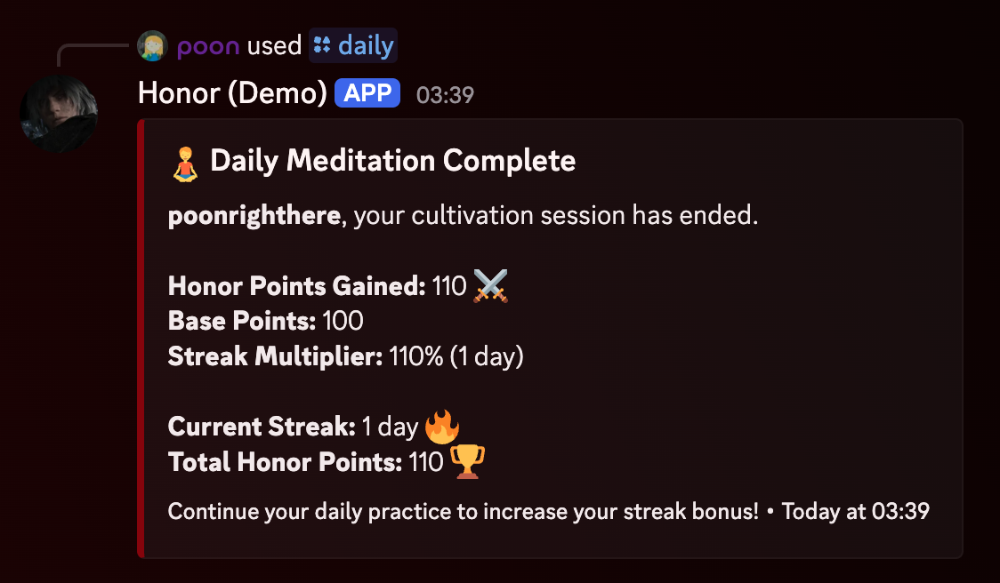
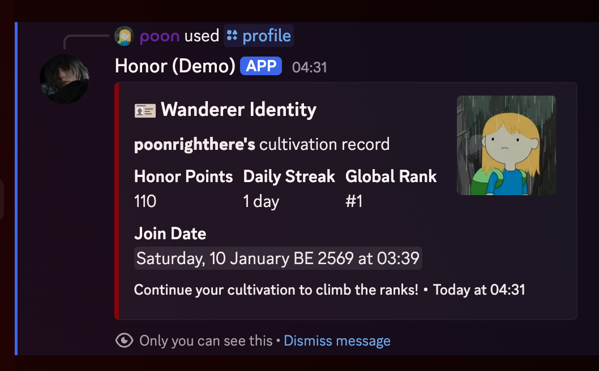
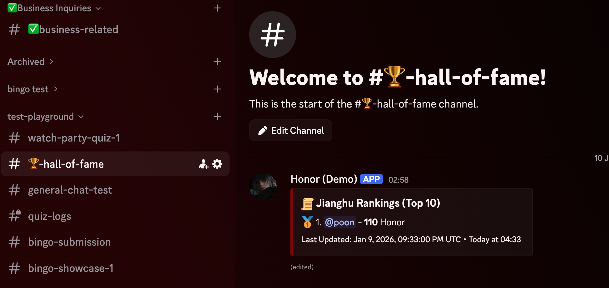
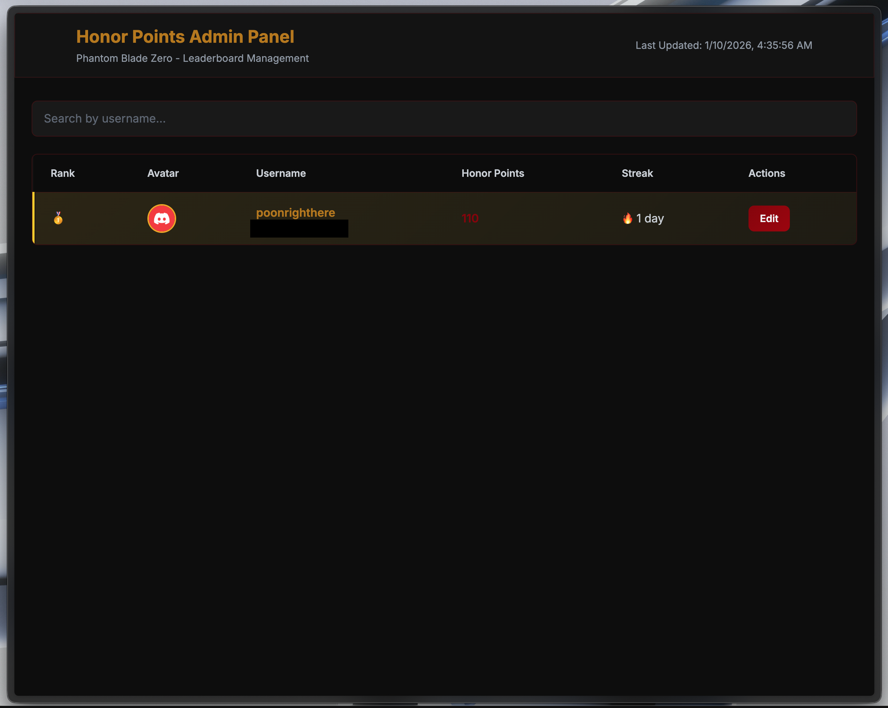
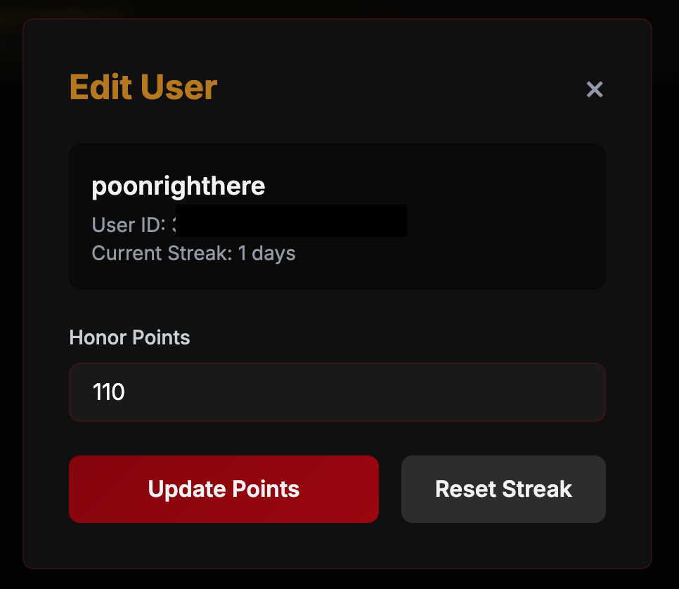
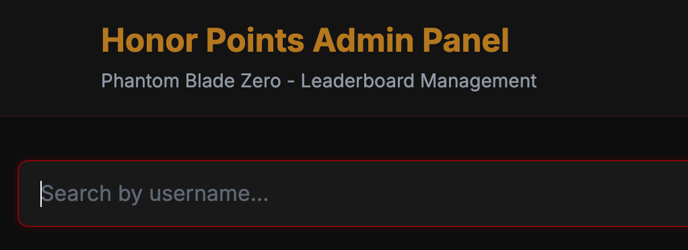
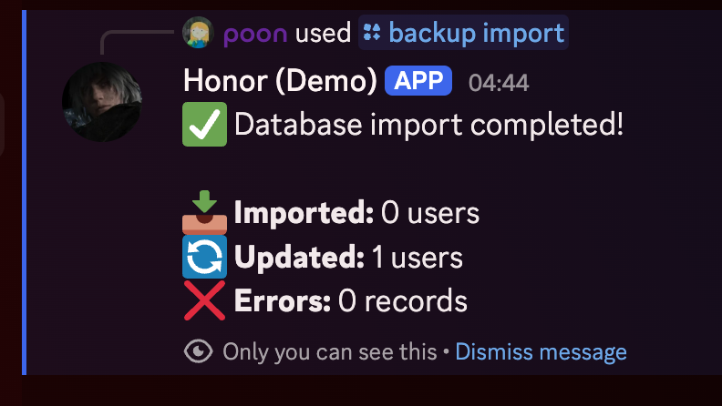

# HonorBot PBZ

<div align="center"></div>

**A feature-rich Discord bot for managing an honor points economy system with button-based interactions, real-time leaderboards, daily check-ins, lucky draws, and an admin dashboard**


[Features](#features) • [Installation](#installation) • [Setup](#setup) • [Demo & Usage](#demo--usage-examples) • [Documentation](#configuration)

</div>

---

## Introduction

**HonorBot PBZ** is a comprehensive Discord.js v14 bot built with TypeScript that gamifies server interaction through an honor points system. Inspired by the dark Wuxia theme of Phantom Blade Zero, it provides a complete economy system with automatic point earning, daily check-ins with weighted random rewards, gambling features, real-time leaderboards, and a powerful admin dashboard.

### Key Highlights

- 🔘 **Button-Based Interactions** - Primary interaction method using persistent buttons in dedicated channels
- 📊 **Real-time Leaderboard** - Automatically updates every 3 minutes in Hall of Fame channel
- 🎯 **Smart Point System** - Earn points through chat activity with daily limits and cooldowns
- 🎲 **Daily Rewards** - Claim daily honor points with weighted random distribution (1-10 points)
- 🎰 **Gambling System** - Coin flip game with ephemeral results (private to player)
- 🎁 **Lucky Draw** - Daily lucky draw feature with random rewards
- 📖 **Instruction Guide** - Comprehensive guide channel showing how to use all features
- 🌐 **Admin Dashboard** - Web-based admin panel for managing users and viewing statistics
- 🔒 **Security First** - Comprehensive security audit with rate limiting, input validation, and XSS protection
- 🐳 **Docker Ready** - Full Docker Compose support for easy deployment

---

## Features

### 🔘 Button-Based Interactions (Primary Method)

The bot uses **persistent buttons** in dedicated channels as the primary interaction method. Slash commands are **admin-only** for backend management.

**Available Buttons:**
- **🧘 Daily Check-in** - Click button in daily-checkin channel to claim daily reward (1-10 random points)
- **🪪 View Profile** - Click button in profile channel to view your honor points, rank, and statistics
- **📊 Check Status** - Click button in status channel to check daily quota and cooldown information
- **🎰 Coin Flip Game** - Click button in gamble channel to play (bet 1-5 points, win double or lose)
  - Results are **ephemeral** (only visible to you) and dismissible
- **🎁 Lucky Draw** - Click button in luckydraw channel for daily lucky draw rewards

**Instruction Channel:**
- **📖 Instruction Guide** - Comprehensive guide channel showing how to use all buttons and features
- Auto-updates with channel mentions for easy navigation

**Hall of Fame (Leaderboard):**
- **🏆 Auto-updating Leaderboard** - View live leaderboard in Hall of Fame channel
- Updates every 3 minutes automatically
- Shows top 10 users with medal emojis (🥇🥈🥉)

### 👑 Admin Commands (Slash Commands)

**Note:** Regular user commands are blocked. Only administrators can use slash commands for backend management.

- **`/backup export`** - Export entire database backup (Administrator only, sent via DM)
- **`/backup import <file>`** - Import database backup from JSON file (Administrator only)
- **`/reset database`** - Reset the entire database - WARNING: This will delete ALL user data! (Administrator only, requires confirmation)

### ⚡ Automatic Features

- **Message Points System** - Earn 1-5 random honor points per message (max 5 times/day)
  - **Reaction Feedback**: The bot uses emoji reactions instead of text replies to keep chat clean
    - Number emoji (1️⃣-5️⃣) = Points earned from that message
    - ⏳ = Cooldown active (wait 60 seconds between rewards)
    - ✅ = Daily limit reached (appears on the 5th message)
    - No reaction = Daily limit exceeded (no points earned)
  - 60-second cooldown between rewards
  - Daily limit: 5 messages per day (resets at midnight UTC)
  - Use Profile or Status buttons to view your daily message progress and today's message points
- **Hall of Fame (Real-time Leaderboard)** - Auto-updates every 3 minutes in Hall of Fame channel
  - Shows top 10 users with rankings
  - Medal emojis for top 3 (🥇🥈🥉)
  - No button needed - just view the channel
- **Daily Reward System** - Claim daily honor points with weighted random distribution
  - Earn 1-10 random honor points each day
  - Weighted probability favors lower points (1 point: 30%, 2 points: 20%, etc.)
  - Available once per day (resets at midnight UTC)
  - Use the button in daily-checkin channel
- **Lucky Draw System** - Daily lucky draw feature
  - Click button in luckydraw channel
  - Get random rewards daily
  - Daily limit applies

### 👑 Admin Commands

- **`/backup export`** - Export entire database backup (Administrator only, sent via DM)
- **`/backup import <file>`** - Import database backup from JSON file (Administrator only)
- **`/reset database`** - Reset the entire database - WARNING: This will delete ALL user data! (Administrator only, requires confirmation)

### 🌐 Web Dashboard

- **Admin Panel** - Full-featured web interface at `http://localhost:3000`
- **User Management** - Edit user points, search by username
- **Leaderboard View** - View top 50 users with real-time updates
- **Secure Authentication** - Protected with HTTP Basic Auth
- **Modern UI** - Dark Wuxia-themed design with Tailwind CSS

---

## Prerequisites

Before you begin, ensure you have the following installed:

- **Node.js** 18.0.0 or higher
- **npm** (comes with Node.js) or **yarn**
- **MongoDB** (local installation or cloud instance like MongoDB Atlas)
- **Discord Bot Token** ([How to create a Discord bot](https://discord.com/developers/applications))
- **Discord Application Client ID** (from your Discord Developer Portal)
- **Discord Server (Guild) ID** (the server where you want to deploy the bot)

### Optional Prerequisites

- **Docker & Docker Compose** (for containerized deployment)
- **Git** (for cloning the repository)

---

## Installation

### Step 1: Clone the Repository

```bash
git clone <your-repo-url>
cd honorbot-pbz
```

### Step 2: Install Dependencies

```bash
npm install
```

This will install all required dependencies including:

- `discord.js` v14
- `mongoose` for MongoDB
- `express` for the web dashboard
- `typescript` and related type definitions
- And other production and development dependencies

### Step 3: Build the Project

```bash
npm run build
```

This compiles TypeScript source files to JavaScript in the `dist/` directory.

---

## Setup

### Step 1: Configure Environment Variables

Create a `.env` file in the root directory. You can use the template below:

```env
# Discord Configuration
DISCORD_TOKEN=your_discord_bot_token_here
CLIENT_ID=your_discord_client_id_here
GUILD_ID=your_discord_guild_id_here

# MongoDB Configuration
MONGO_URI=mongodb://localhost:27017/honorbot
# For Docker Compose, use: mongodb://mongodb:27017/honorbot

# Button Channels (Required)
DAILYCHECKING_CHANNEL_ID=your_daily_checkin_channel_id
PROFILE_CHANNEL_ID=your_profile_channel_id
STATUS_CHANNEL_ID=your_status_channel_id
GAMBLE_CHANNEL_ID=your_gamble_channel_id
INSTRUCTION_CHANNEL_ID=your_instruction_channel_id

# Hall of Fame (Auto-updating Leaderboard)
LEADERBOARD_CHANNEL_ID=your_hall_of_fame_channel_id

# Lucky Draw (Optional)
LUCKYDRAW_CHANNEL_ID=your_luckydraw_channel_id

# Web Dashboard Configuration
PORT=3000
WEB_USER=admin
WEB_PASS=your_secure_password_here_change_this
ALLOWED_ORIGIN=http://localhost:3000

# Feature Flags
ENABLE_STREAK=true

# Message Points System
DAILY_MESSAGE_POINTS_LIMIT=100

# Environment
NODE_ENV=production
```

**⚠️ Important Security Notes:**

- Never commit your `.env` file to version control (already in `.gitignore`)
- Use a strong password for `WEB_PASS` in production
- Keep your `DISCORD_TOKEN` secret and secure

### Step 2: Set Up MongoDB

#### Option A: Local MongoDB

1. Install MongoDB locally ([Download MongoDB](https://www.mongodb.com/try/download/community))
2. Start MongoDB service
3. Update `MONGO_URI` in `.env` to: `mongodb://localhost:27017/honorbot`

#### Option B: MongoDB Atlas (Cloud)

1. Create a free account at [MongoDB Atlas](https://www.mongodb.com/cloud/atlas)
2. Create a cluster and database
3. Get your connection string and update `MONGO_URI` in `.env`

#### Option C: Docker Compose (Recommended for Development)

See [Docker Deployment](#docker-deployment) section below.

### Step 3: Deploy Discord Slash Commands

Before starting the bot, you need to register the slash commands with Discord:

```bash
npm run deploy
```

**Expected Output:**

```
[Deploy] Starting to refresh X application (/) commands...
[Deploy] ✓ Successfully reloaded X application (/) commands.
[Deploy] Registered commands: daily, profile, status, leaderboard, gamble, backup, reset
```

**Note:** User commands (`/daily`, `/profile`, `/status`, `/leaderboard`, `/gamble`) are blocked for regular users. Only administrators can use them for backend management. Regular users should use buttons in dedicated channels instead.

If you encounter any issues or need to clear commands:

```bash
npm run clear-commands
npm run deploy
```

### Step 4: Start the Bot

#### Development Mode (with auto-reload)

```bash
npm run dev
```

This uses `nodemon` to automatically restart the bot when files change. Useful for development.

#### Production Mode

```bash
npm start
```

**Expected Output:**

```
Bot is starting...
Connected to MongoDB successfully
Logged in as YourBotName#1234!
Bot is ready! Use "npm run deploy" to register slash commands.
[Dashboard] Admin Panel running on http://localhost:3000
[LeaderboardService] Starting leaderboard service...
[UserInteractionService] Initializing user interaction service...
[UserInteractionService] ✓ profile button message sent successfully
[UserInteractionService] ✓ status button message sent successfully
[UserInteractionService] ✓ gamble button message sent successfully
[UserInteractionService] ✓ instruction message sent successfully
```

---

## Demo & Usage Examples

This section provides visual examples and terminal outputs to help you understand how HonorBot PBZ works.

### Button-Based Interactions

The bot uses **persistent buttons** in dedicated channels as the primary interaction method.

#### Daily Check-in Button



- Click "Claim Daily" button in daily-checkin channel
- Earn 1-10 random honor points
- Available once per day

#### Profile Button



- Click "View Profile" button in profile channel
- View honor points, rank, daily progress, and statistics
- Private view (ephemeral)

#### Status Button

- Click "Check Status" button in status channel
- View daily quota, cooldown status, and check-in availability
- Private view (ephemeral)

#### Gamble Button

- Click "Play Gamble" button in gamble channel
- Fill modal with choice (heads/tails) and bet amount (1-5)
- Results are **ephemeral** (only visible to you, dismissible)
- Keeps the channel clean

#### Hall of Fame (Auto-updating Leaderboard)



- View live leaderboard in Hall of Fame channel
- Auto-updates every 3 minutes
- Shows top 10 users with medal emojis (🥇🥈🥉)
- No button needed - just view the channel

#### Instruction Channel

- Comprehensive guide showing how to use all buttons
- Explains all features and rules
- Auto-updates with channel mentions
- No button needed - just view the channel

### Admin Web Dashboard

#### Dashboard Overview



#### User Management Modal



#### Dashboard Search Functionality



### Terminal Output Examples

#### Bot Startup Logs


#### Command Deployment Logs


#### Message Points Logging


#### Leaderboard Update Logs


#### Bot Running (Continuous Logs)


#### Error Handling Examples


### Usage Workflow Examples

#### Example 1: New User Journey

1. **First Message:** User sends a message → Earns 3 points (bot reacts with 3️⃣)
2. **Check Profile:** User clicks "View Profile" button in profile channel → Sees "Unranked" status, 3 honor points
3. **Daily Check-in:** User clicks "Claim Daily" button in daily-checkin channel → Earns 5 points (random 1-10)
4. **More Messages:** User chats → Earns more points, daily counter increments
5. **Check Status:** User clicks "Check Status" button in status channel → Sees current points, daily quota, cooldown
6. **Check Rankings:** User views Hall of Fame channel → Sees live leaderboard with top 10 users

#### Example 2: Daily Rewards

1. **Day 1:** Click "Claim Daily" button → Earned 3 points (weighted random: 1-10 points)
2. **Day 2:** Click "Claim Daily" button → Earned 7 points
3. **Day 3:** Click "Claim Daily" button → Earned 2 points
4. **Day 4:** Click "Claim Daily" button → Earned 10 points (rare high reward!)

#### Example 3: Gamble Feature

1. User has 50 honor points
2. Clicks "Play Gamble" button in gamble channel
3. Fills modal: Choice = "heads", Bet Amount = 3
4. Coin shows **Heads** → User wins! Gets 6 points (double the bet)
5. Result shown as ephemeral message (only visible to user, dismissible)
6. New balance: 53 points (50 - 3 + 6)

#### Example 4: Admin Backup Workflow




---

## Docker Deployment

### Using Docker Compose (Recommended)

Docker Compose simplifies deployment by managing both MongoDB and the bot application.

#### Step 1: Update Environment Variables

Ensure your `.env` file has:

```env
MONGO_URI=mongodb://mongodb:27017/honorbot
```

Note: Use `mongodb` as the hostname (Docker service name), not `localhost`.

#### Step 2: Build and Start Services

```bash
docker-compose up --build -d
```

This will:

- Build the bot Docker image
- Start MongoDB container
- Start the bot application container
- Create necessary volumes for data persistence

#### Step 3: View Logs

```bash
# View all logs
docker-compose logs -f

# View only bot logs
docker-compose logs -f app

# View only MongoDB logs
docker-compose logs -f mongodb
```

#### Step 4: Deploy Commands (from within container)

```bash
docker-compose exec app npm run deploy
```

#### Step 5: Stop Services

```bash
docker-compose down
```

To also remove volumes (⚠️ **WARNING:** This deletes your database):

```bash
docker-compose down -v
```

### Manual Docker Build

If you prefer to build and run manually:

```bash
# Build the image
docker build -t honorbot-pbz .

# Run the container
docker run -d \
  --name honorbot-app \
  --env-file .env \
  -p 3000:3000 \
  --link mongodb:mongodb \
  honorbot-pbz
```

---

## Configuration

### Environment Variables

| Variable                     | Description                                                | Required | Default                 |
| ---------------------------- | ---------------------------------------------------------- | -------- | ----------------------- |
| `DISCORD_TOKEN`              | Discord bot token                                          | ✅ Yes   | -                       |
| `CLIENT_ID`                  | Discord application client ID                              | ✅ Yes   | -                       |
| `GUILD_ID`                   | Discord server (guild) ID                                  | ✅ Yes   | -                       |
| `MONGO_URI`                  | MongoDB connection string                                  | ✅ Yes   | -                       |
| `LEADERBOARD_CHANNEL_ID`     | Channel ID for Hall of Fame (auto-updating leaderboard)   | ✅ Yes   | -                       |
| `DAILYCHECKING_CHANNEL_ID`   | Channel ID for daily reward button                         | ✅ Yes   | -                       |
| `PROFILE_CHANNEL_ID`         | Channel ID for profile button                              | ✅ Yes   | -                       |
| `STATUS_CHANNEL_ID`          | Channel ID for status button                               | ✅ Yes   | -                       |
| `GAMBLE_CHANNEL_ID`          | Channel ID for gamble button                               | ✅ Yes   | -                       |
| `LUCKYDRAW_CHANNEL_ID`       | Channel ID for lucky draw button                           | ❌ No    | -                       |
| `INSTRUCTION_CHANNEL_ID`     | Channel ID for instruction guide                          | ✅ Yes   | -                       |
| `PORT`                       | Web dashboard port                                         | ❌ No    | `3000`                  |
| `WEB_USER`                   | Admin panel username                                       | ❌ No    | `admin`                 |
| `WEB_PASS`                   | Admin panel password (⚠️ **REQUIRED in production**)       | ❌ No    | `password` (dev only)   |
| `ENABLE_STREAK`              | Enable daily streak multiplier (currently not used)       | ❌ No    | `true`                  |
| `DAILY_MESSAGE_POINTS_LIMIT` | Daily limit for message points                             | ❌ No    | `100`                   |
| `ALLOWED_ORIGIN`             | CORS allowed origin for dashboard                          | ❌ No    | `http://localhost:3000` |
| `NODE_ENV`                   | Environment mode (`production` or `development`)           | ❌ No    | `production`            |

### Feature Flags

#### `ENABLE_STREAK`

**Note:** This feature flag is currently not used. The daily reward system uses weighted random distribution (1-10 points) instead of streak multipliers.

- **Default:** `true` (for future use)
- The current daily reward system gives 1-10 random honor points with weighted probability

#### `DAILY_MESSAGE_POINTS_LIMIT`

Controls how many points users can earn from messages per day:

- **Default:** `100`
- **Note:** This variable is for reference only. The actual system limits users to **5 messages per day** (not points-based)
- **Recommendations:**
  - `50` - More restrictive, quality-focused
  - `100` - Balanced (default)
  - `150` - More lenient for active servers
  - `200` - Maximum for highly active communities
- Resets automatically at midnight UTC

#### Channel IDs for Button-Based Interactions

The bot uses persistent buttons in dedicated channels. Each channel requires a channel ID in `.env`:

- **`DAILYCHECKING_CHANNEL_ID`** - Daily reward claim button
- **`PROFILE_CHANNEL_ID`** - View profile button
- **`STATUS_CHANNEL_ID`** - Check status button
- **`GAMBLE_CHANNEL_ID`** - Coin flip game button (results are ephemeral)
- **`LUCKYDRAW_CHANNEL_ID`** - Lucky draw button (optional)
- **`INSTRUCTION_CHANNEL_ID`** - Instruction guide (comprehensive guide for all features)
- **`LEADERBOARD_CHANNEL_ID`** - Hall of Fame (auto-updating leaderboard, no button needed)

**Setup:**
1. Create channels in your Discord server
2. Copy channel IDs (right-click → Copy ID, requires Developer Mode)
3. Add to `.env` file
4. Restart the bot

**Behavior:**
- Buttons are persistent and auto-recreate if deleted
- Button messages update every 3 minutes
- All button interactions are ephemeral (private to user)
- Gamble results are ephemeral and dismissible

---

## Usage

### Setting Up Discord Commands

**Note:** User commands are blocked for regular users. Only administrators can use slash commands for backend management.

#### Initial Deployment

```bash
npm run deploy
```

This registers all slash commands to your Discord server. Commands appear immediately in Discord.

#### Updating Commands

After modifying command files:

```bash
npm run build
npm run deploy
```

#### Clearing All Commands

If you need to remove all commands:

```bash
npm run clear-commands
```

Then redeploy with `npm run deploy`.

### Using Button-Based Interactions

The bot primarily uses **persistent buttons** in dedicated channels:

1. **Create Required Channels:**
   - Daily check-in channel
   - Profile channel
   - Status channel
   - Gamble channel
   - Instruction channel
   - Hall of Fame channel (for leaderboard)

2. **Add Channel IDs to `.env`:**
   ```env
   DAILYCHECKING_CHANNEL_ID=your_channel_id
   PROFILE_CHANNEL_ID=your_channel_id
   STATUS_CHANNEL_ID=your_channel_id
   GAMBLE_CHANNEL_ID=your_channel_id
   INSTRUCTION_CHANNEL_ID=your_channel_id
   LEADERBOARD_CHANNEL_ID=your_channel_id
   LUCKYDRAW_CHANNEL_ID=your_channel_id  # Optional
   ```

3. **Restart Bot:**
   - Buttons will be created automatically in each channel
   - Instruction channel will show comprehensive guide
   - Buttons auto-update every 3 minutes

See [`BUTTON_SETUP.md`](./BUTTON_SETUP.md) for detailed setup instructions.

### Accessing the Admin Dashboard

1. **Start the bot** (see [Setup](#setup) section)
2. **Navigate to:** `http://localhost:3000` in your browser
3. **Login with:**
   - Username: Your `WEB_USER` (default: `admin`)
   - Password: Your `WEB_PASS`
4. **Features Available:**
   - View top 50 users in leaderboard
   - Search users by username
   - Edit user honor points
   - Real-time updates (refreshes every 30 seconds)

### Backup and Restore

#### Exporting Database

1. In Discord, use the `/backup export` command (Administrator only)
2. The bot will send you a JSON file via Direct Message
3. Save this file securely - it contains all user data

#### Importing Database

1. Prepare your backup JSON file
2. In Discord, use `/backup import`
3. Attach the JSON file to the command
4. The bot will import all users and update existing records
5. You'll receive a summary of imported/updated records

**⚠️ Warning:** Importing will overwrite existing user data. Always backup before importing.

---

## Project Structure

```
honorbot-pbz/
├── demo-usage-examples/    # Screenshots and demo images (add your images here)
│   ├── daily-command-first.png
│   ├── daily-command-streak.png
│   ├── profile-command.png
│   ├── leaderboard-command.png
│   ├── help-command.png
│   ├── leaderboard-channel.png
│   ├── admin-dashboard-overview.png
│   ├── admin-edit-modal.png
│   ├── admin-dashboard-search.png
│   ├── terminal-bot-startup.png
│   ├── terminal-command-deployment.png
│   ├── terminal-message-points.png
│   ├── terminal-leaderboard-update.png
│   ├── terminal-bot-running.png
│   ├── terminal-error-handling.png
│   ├── backup-export.png
│   └── backup-import.png
├── src/
│   ├── commands/              # Discord slash commands (admin-only)
│   │   ├── backup.ts          # Admin backup/restore commands
│   │   ├── daily.ts           # Daily check-in command (blocked for users)
│   │   ├── gamble.ts          # Coin flip gambling command (blocked for users)
│   │   ├── leaderboard.ts     # Leaderboard command (blocked for users)
│   │   ├── profile.ts          # User profile command (blocked for users)
│   │   ├── reset.ts           # Admin database reset command
│   │   └── status.ts          # User status command (blocked for users)
│   ├── dashboard/             # Web admin panel
│   │   ├── public/            # Static files (HTML, CSS, JS)
│   │   │   └── index.html     # Admin dashboard UI
│   │   └── server.ts          # Express server and API endpoints
│   ├── events/                # Discord event handlers
│   │   ├── interactionCreate.ts  # Handles button and slash command interactions
│   │   └── messageCreate.ts      # Handles message events (point earning)
│   ├── models/                # Mongoose schemas
│   │   └── User.ts            # User data model
│   ├── services/              # Business logic services
│   │   ├── BackupService.ts   # Database backup/restore logic
│   │   ├── LeaderboardService.ts  # Leaderboard update service
│   │   ├── LuckyDrawService.ts    # Lucky draw service
│   │   └── UserInteractionService.ts  # Persistent button management
│   ├── utils/                 # Utility functions
│   │   └── connectDB.ts       # MongoDB connection handler
│   ├── deploy-commands.ts     # Script to deploy slash commands
│   ├── clear-commands.ts      # Script to clear all commands
│   └── index.ts               # Main entry point
├── dist/                      # Compiled JavaScript (generated)
├── node_modules/              # Dependencies (generated)
├── docker-compose.yml         # Docker Compose configuration
├── Dockerfile                 # Docker build configuration
├── tsconfig.json              # TypeScript configuration
├── package.json               # Node.js dependencies and scripts
├── package-lock.json          # Dependency lock file
├── .gitignore                 # Git ignore rules
├── SECURITY_AUDIT.md          # Security audit report
├── PRE_DEPLOYMENT_CHECKLIST.md # Pre-deployment checklist
└── README.md                  # This file
```

---

## Scripts

| Script                   | Description                                         |
| ------------------------ | --------------------------------------------------- |
| `npm run build`          | Compile TypeScript to JavaScript                    |
| `npm start`              | Start the production server (requires build first)  |
| `npm run dev`            | Start development server with auto-reload (nodemon) |
| `npm run watch`          | Watch TypeScript files and compile on changes       |
| `npm run deploy`         | Deploy slash commands to Discord                    |
| `npm run clear-commands` | Clear all Discord slash commands                    |

---

## Technologies

### Core Technologies

- **[Discord.js v14](https://discord.js.org/)** - Modern Discord API wrapper for Node.js
- **[TypeScript](https://www.typescriptlang.org/)** - Type-safe JavaScript for better code quality
- **[MongoDB](https://www.mongodb.com/)** - NoSQL database for user data storage
- **[Mongoose](https://mongoosejs.com/)** - MongoDB object modeling for Node.js
- **[Express.js](https://expressjs.com/)** - Fast, minimalist web framework for the admin dashboard

### Supporting Libraries

- **[Node-cron](https://www.npmjs.com/package/node-cron)** - Task scheduler for automated leaderboard updates
- **[Tailwind CSS](https://tailwindcss.com/)** - Utility-first CSS framework for dashboard styling
- **[express-rate-limit](https://www.npmjs.com/package/express-rate-limit)** - Rate limiting middleware for API protection
- **[express-basic-auth](https://www.npmjs.com/package/express-basic-auth)** - HTTP Basic Authentication for dashboard
- **[dotenv](https://www.npmjs.com/package/dotenv)** - Environment variable management

### Development Tools

- **[nodemon](https://nodemon.io/)** - Automatic server restart during development
- **[ts-node](https://typestrong.org/ts-node/)** - TypeScript execution for Node.js
- **[Docker](https://www.docker.com/)** - Containerization for consistent deployments

---

## Security

This project follows security best practices and has undergone a comprehensive security audit. For detailed information about security considerations, vulnerabilities found, and fixes implemented, please see [`SECURITY_AUDIT.md`](./SECURITY_AUDIT.md).

### Security Features

- ✅ **Input Validation** - All user inputs are validated and sanitized
- ✅ **XSS Protection** - Proper HTML escaping and event delegation
- ✅ **Rate Limiting** - API endpoints protected against brute-force and DoS attacks
  - General API: 100 requests per 15 minutes
  - Write operations: 50 requests per 15 minutes
- ✅ **Authentication** - Basic Auth with strong password requirements
- ✅ **CORS Protection** - Restricted cross-origin requests
- ✅ **NoSQL Injection Protection** - Mongoose parameterized queries
- ✅ **Error Sanitization** - Production-safe error messages
- ✅ **Path Traversal Protection** - Explicit path validation
- ✅ **Secrets Management** - Environment variables, no hardcoded credentials

### Reporting Security Issues

If you discover a security vulnerability, please **do not** open a public issue. Instead, please report it privately via:

- Opening a security advisory on GitHub
- Contacting the maintainers directly

We take security seriously and will respond promptly to any security concerns.

---

## Troubleshooting

### Common Issues

#### Buttons not appearing or not working

1. **Check channel IDs in `.env`:**
   - Verify all required channel IDs are set
   - Ensure channel IDs are correct (17-19 digit numbers)
2. **Verify bot has required permissions:**
   - View Channels
   - Send Messages
   - Embed Links
   - Manage Messages (for editing button messages)
3. **Check bot logs:**
   ```bash
   docker-compose logs -f app | grep UserInteractionService
   ```
4. **Restart bot** to recreate buttons

#### User commands blocked

**This is expected behavior.** User commands (`/daily`, `/profile`, `/status`, `/leaderboard`, `/gamble`) are blocked for regular users. Only administrators can use them.

- **Regular users:** Use buttons in dedicated channels
- **Admins:** Can use slash commands for testing/management

#### Leaderboard not updating

1. **Verify `LEADERBOARD_CHANNEL_ID` is set correctly** in `.env`
2. **Check bot has permissions** in the leaderboard channel:
   - View Channel
   - Send Messages
   - Manage Messages (to edit existing leaderboard)
3. **Check logs** for leaderboard service errors:
   ```bash
   # If using Docker
   docker-compose logs -f app | grep LeaderboardService
   ```

#### MongoDB connection errors

1. **Verify MongoDB is running:**

   ```bash
   # Local MongoDB
   mongosh

   # Docker
   docker-compose ps mongodb
   ```

2. **Check `MONGO_URI` is correct** in `.env`
3. **For Docker Compose:** Use `mongodb://mongodb:27017/honorbot` (not `localhost`)

#### Dashboard not accessible

1. **Verify bot is running** and dashboard started:
   ```
   [Dashboard] Admin Panel running on http://localhost:3000
   ```
2. **Check port 3000 is not in use:**

   ```bash
   # Linux/Mac
   lsof -i :3000

   # Windows
   netstat -ano | findstr :3000
   ```

3. **Change `PORT` in `.env`** if port 3000 is occupied

#### TypeScript compilation errors

1. **Clean and rebuild:**
   ```bash
   rm -rf dist/
   npm run build
   ```
2. **Verify Node.js version:**
   ```bash
   node --version  # Should be 18+
   ```
3. **Reinstall dependencies:**
   ```bash
   rm -rf node_modules package-lock.json
   npm install
   ```

---

## Contributing

Contributions are welcome! Please feel free to submit a Pull Request. When contributing:

1. **Fork the repository**
2. **Create a feature branch:** `git checkout -b feature/amazing-feature`
3. **Commit your changes:** `git commit -m 'Add amazing feature'`
4. **Push to the branch:** `git push origin feature/amazing-feature`
5. **Open a Pull Request**

### Development Guidelines

- Follow existing code style and TypeScript conventions
- Add comments for complex logic
- Update documentation for new features
- Test your changes thoroughly
- Ensure `npm run build` completes without errors

---

## License

This project is licensed under the **ISC License**.

---

## Support

For issues and questions:

- **Open an issue** on GitHub for bug reports or feature requests
- **Check existing issues** before creating new ones
- **Read the documentation** thoroughly before asking questions

---

## Acknowledgments

- Inspired by the Wuxia theme of **Phantom Blade Zero**
- Built with [Discord.js](https://discord.js.org/) - A powerful library for interacting with the Discord API
- Uses [Mongoose](https://mongoosejs.com/) for elegant MongoDB object modeling

---

<div align="center">

**Made with ❤️ for the Discord community**

**⚠️ Note:** Make sure to keep your `.env` file secure and never commit it to version control. The `.gitignore` file is already configured to exclude sensitive files.

</div>
